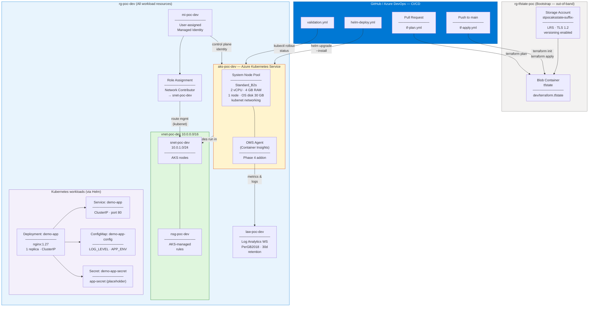

# Azure Infrastructure Architecture

> **AKS AI Troubleshooting POC** — Platform foundation for AI-powered diagnostics on Azure Kubernetes Service.
> All decisions and assumptions are documented in [AGENT_CONTEXT.md](../AGENT_CONTEXT.md).

---

## Architecture Diagram



---

## Resource Inventory

| Resource | Type | Name | SKU / Size | Notes |
|---------|------|------|-----------|-------|
| Resource Group | `azurerm_resource_group` | `rg-poc-dev` | — | All workload resources |
| Virtual Network | `azurerm_virtual_network` | `vnet-poc-dev` | — | CIDR: `10.0.0.0/16` |
| Subnet | `azurerm_subnet` | `snet-poc-dev` | — | CIDR: `10.0.1.0/24` — AKS nodes |
| Network Security Group | `azurerm_network_security_group` | `nsg-poc-dev` | — | AKS manages its own rules |
| Managed Identity | `azurerm_user_assigned_identity` | `mi-poc-dev` | — | AKS control plane identity |
| Role Assignment | `azurerm_role_assignment` | — | Network Contributor | MI → subnet (kubenet route mgmt) |
| Log Analytics Workspace | `azurerm_log_analytics_workspace` | `law-poc-dev` | PerGB2018 · 30-day retention | Observability foundation |
| AKS Cluster | `azurerm_kubernetes_cluster` | `aks-poc-dev` | kubenet · local accounts | 1× Standard_B2s system node |
| Node Pool | (within AKS) | `system` | Standard_B2s · 1 node · 30 GB OS | ~$34/month while running |
| Terraform State RG | `azurerm_resource_group` (bootstrap) | `rg-tfstate-poc` | — | Separate lifecycle — NOT in main Terraform state |
| Terraform State SA | `azurerm_storage_account` (bootstrap) | `stpocaksstate‹suffix›` | Standard LRS | Blob versioning enabled |
| Terraform State Container | `azurerm_storage_container` (bootstrap) | `tfstate` | Private | Key: `dev/terraform.tfstate` |

---

## Network Design

```
VNet: vnet-poc-dev  (10.0.0.0/16)
│
└── Subnet: snet-poc-dev  (10.0.1.0/24)
    │   AKS node VMs
    └── NSG: nsg-poc-dev
            Rules managed by AKS (auto-created)

AKS kubenet CIDR allocations:
  Pod CIDR:      10.244.0.0/16   (pods — non-overlapping with VNet)
  Service CIDR:  10.96.0.0/16    (K8s services — non-overlapping)
  DNS Service IP: 10.96.0.10     (within service CIDR)

No public endpoints on nodes.
AKS API server: public (default — acceptable for POC).
```

---

## Identity & Security

| Concern | Decision | Details |
|---------|---------|---------|
| AKS authentication | Local K8s accounts + K8s RBAC | No Entra ID — single-person POC. Revisit before multi-user. |
| AKS identity | User-assigned Managed Identity | `mi-poc-dev` — no client secret rotation |
| Network permissions | Network Contributor on subnet | Required for kubenet route table management |
| Secrets at rest | K8s Secret (placeholder) | `REPLACE_ME` — Key Vault CSI driver is a future phase |
| Terraform state | Private blob, LRS, TLS 1.2 | No public access on storage account |
| Pipelines | Service connection `sc-azure-poc` | No credentials in YAML — `addSpnToEnvironment: true` for ARM auth |
| App secret in CI/CD | ADO secret pipeline variable | `APP_SECRET` — never in YAML or variable groups |

---

## Cost Estimate (dev environment, eastus)

| Resource | Estimated Monthly Cost | Notes |
|---------|----------------------|-------|
| AKS Node (Standard_B2s × 1) | ~$34 | Burstable; stop cluster when idle to save |
| Log Analytics Workspace | ~$0–2 | PerGB2018; cost starts when data flows |
| VNet / Subnet / NSG | $0 | No charge for basic networking |
| Managed Identity | $0 | Free |
| Terraform State Storage (LRS) | < $1 | Minimal state file |
| **Total (cluster running)** | **~$35–37/month** | Stop cluster: `az aks stop ...` |
| **Total (cluster stopped)** | **< $3/month** | Storage + LAW base cost only |

**Cost controls:**
```bash
# Stop cluster when not in use (saves ~$34/month)
az aks stop --resource-group rg-poc-dev --name aks-poc-dev

# Restart when needed
az aks start --resource-group rg-poc-dev --name aks-poc-dev

# Full teardown
cd terraform/environments/dev && terraform destroy
```

---

## CI/CD Flow

```
┌─────────────────────────────────────────────────────────────────┐
│  Developer opens PR touching terraform/**                        │
│                                                                  │
│  ┌──────────────────────┐                                        │
│  │  terraform-plan.yml  │  → terraform init + plan (no apply)   │
│  └──────────────────────┘                                        │
└─────────────────────────────────────────────────────────────────┘

┌─────────────────────────────────────────────────────────────────┐
│  PR merged to main                                               │
│                                                                  │
│  ┌──────────────────────────────────────────────────────────┐   │
│  │  terraform-apply.yml                                      │   │
│  │                                                           │   │
│  │  Stage 1: Plan  →  publish terraform.tfplan artifact     │   │
│  │  Stage 2: Approve  →  manual gate (ADO environment:dev)  │   │
│  │  Stage 3: Apply  →  terraform apply terraform.tfplan      │   │
│  │  Stage 4: Export  →  terraform output → pipeline vars    │   │
│  └──────────────────────────────────────────────────────────┘   │
└─────────────────────────────────────────────────────────────────┘

┌─────────────────────────────────────────────────────────────────┐
│  Manual trigger (after infra apply)                              │
│                                                                  │
│  ┌──────────────────────┐    ┌────────────────────────┐         │
│  │  helm-deploy.yml     │    │  validation.yml         │         │
│  │                      │    │                         │         │
│  │  az aks get-creds    │    │  kubectl rollout status │         │
│  │  helm upgrade        │ →  │  kubectl get pods       │         │
│  │  --install demo-app  │    │  helm status            │         │
│  └──────────────────────┘    └────────────────────────┘         │
└─────────────────────────────────────────────────────────────────┘
```

---

## Repository Structure

```
aks-ai-troubleshooting-poc/
├── AGENT_CONTEXT.md               # Project decisions, assumptions, phase log
├── README.md                      # Quick-start guide
│
├── terraform/
│   ├── bootstrap/
│   │   ├── main.tf                # Alternative: Terraform-based state backend creation
│   │   └── terraform.tfvars.example
│   │
│   ├── modules/
│   │   ├── networking/            # VNet · subnet · NSG
│   │   │   ├── main.tf
│   │   │   ├── variables.tf
│   │   │   └── outputs.tf
│   │   ├── identity/              # User-assigned MI · Network Contributor RBAC
│   │   │   ├── main.tf
│   │   │   ├── variables.tf
│   │   │   └── outputs.tf
│   │   ├── monitoring/            # Log Analytics Workspace
│   │   │   ├── main.tf
│   │   │   ├── variables.tf
│   │   │   └── outputs.tf
│   │   └── aks/                   # AKS cluster · node pool · oms_agent hook
│   │       ├── main.tf
│   │       ├── variables.tf
│   │       └── outputs.tf
│   │
│   └── environments/
│       └── dev/
│           ├── providers.tf       # AzureRM ~> 4.0 · Terraform >= 1.7
│           ├── backend.tf         # Remote state (partial config — SA name at init)
│           ├── main.tf            # Resource group + all module calls
│           ├── variables.tf       # All input declarations
│           ├── outputs.tf         # 6 outputs including az aks get-credentials cmd
│           └── terraform.tfvars.example
│
├── helm/
│   └── demo-app/
│       ├── Chart.yaml             # nginx · v0.1.0
│       ├── values.yaml            # Defaults: 1 replica · ClusterIP · 250m/128Mi
│       ├── values-dev.yaml        # Dev overrides: lower limits · debug logging
│       └── templates/
│           ├── _helpers.tpl       # fullname · labels · selectorLabels
│           ├── deployment.yaml    # Liveness/readiness probes · envFrom
│           ├── service.yaml       # ClusterIP · port 80
│           ├── configmap.yaml     # LOG_LEVEL · APP_ENV
│           ├── secret.yaml        # Placeholder (Key Vault CSI: future phase)
│           └── ingress.yaml       # Disabled by default
│
├── pipelines/
│   ├── terraform-plan.yml         # Trigger: PR to main
│   ├── terraform-apply.yml        # Trigger: push to main (Plan→Approve→Apply)
│   ├── helm-deploy.yml            # Manual trigger
│   ├── validation.yml             # Manual trigger
│   └── templates/
│       ├── terraform-steps.yml    # Reusable: install TF · init · plan/apply
│       └── helm-steps.yml         # Reusable: get-credentials · helm upgrade
│
├── scripts/
│   └── bootstrap-state.sh         # One-time: create Storage Account for TF state
│
└── docs/
    ├── phase1-design.md           # Original solution design document
    ├── runbook.md                 # Step-by-step operations guide
    └── architecture.md            # This file
```

---

## Future Phases

| Phase | Description | Key Changes |
|-------|------------|------------|
| Container Insights (active) | Already wired — run `terraform apply` to enable OMS agent | `oms_agent` block live in `modules/aks/main.tf` |
| Key Vault CSI Driver | Replace `secret.yaml` placeholder | Add `SecretProviderClass` + `secrets-store-csi-driver` addon |
| AI Troubleshooting Agents | Deploy agent pods to AKS | New Helm chart; connects to Log Analytics KQL API |
| Automated Diagnostics | Azure Monitor alert → runbook trigger | Logic Apps / Azure Automation runbooks |
| Root Cause Analysis | AI agent queries Container Insights | LLM + KQL queries on `ContainerLog` / `KubePodInventory` tables |
| Ingress / External Access | Enable ingress for demo-app | Set `ingress.enabled: true` in `values-dev.yaml`; install ingress controller |
| Azure Container Registry | Private image registry | Add ACR resource; attach to AKS with `acr_id` |

---

*Architecture document version: Phase 7 (2026-07-16). See [AGENT_CONTEXT.md](../AGENT_CONTEXT.md) for full decision log.*
